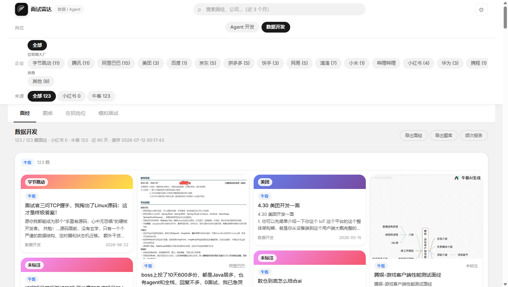
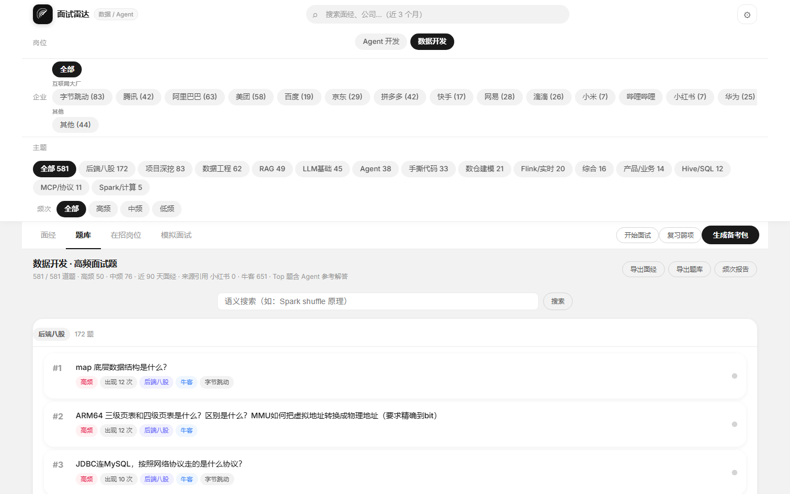
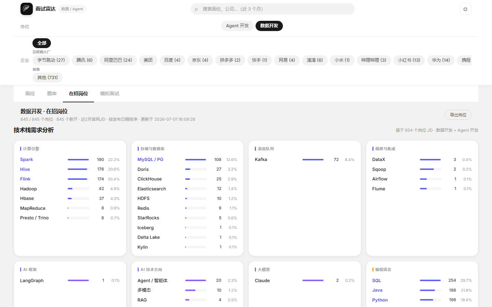
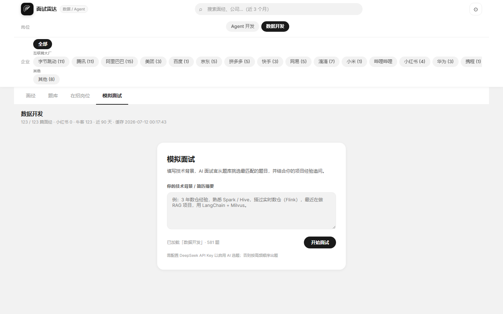

<div align="center">

# InterviewRadar · 面试雷达

**自动抓取小红书 & 牛客真实面经 → AI 过滤 → 生成高频题库 + 在招岗位信息**

[](LICENSE)
[](#)
[](#)

</div>

---

## 它解决什么问题

求职时你需要的是**最近三个月、跟你目标岗位直接相关、高频出现**的面试题——而不是某个静态题库。

InterviewRadar 自动帮你：

| 输入 | 处理 | 输出 |
|------|------|------|
| 小红书 / 牛客面经帖 | DeepSeek AI 过滤垃圾帖、OCR 读图片、提取题目 | 按频次排序的题库 |
| 岗位 + 公司筛选 | 近 90 天时效过滤、公司标签归一化 | 高频题参考解答 |
| Boss 直聘 / 大厂官网 JD | DrissionPage 网络监听绕过风控、增量去重 | 在招岗位 + 技术栈需求分析 |

---

## 界面预览

### 面经流 — 近 90 天真实面经，按公司 / 来源筛选



### 高频题库 — 频次排序 + 考察方向分类 + 语义搜索



### 在招岗位 — 大厂实时 JD + 技术栈需求分析



### 模拟面试 — 填技术背景，AI 面试官从题库选题并结合项目经验追问



---

## 快速开始

### 1. 克隆 & 安装

```bash
git clone https://github.com/Nikka-ops/-.git interview-radar
cd interview-radar
bash install.sh
```

或手动：

```bash
python3.11 -m venv .venv
.venv/bin/pip install -e ".[dev]"
```

### 2. 配置环境变量

在项目根目录创建 `.env` 文件：

```env
# 必填 — AI 过滤 / 题目聚类 / 生成解答
DEEPSEEK_API_KEY=sk-xxxxxxxxxxxxxxxx
DEEPSEEK_API_BASE=https://api.deepseek.com
DEEPSEEK_MODEL=deepseek-chat

# 小红书抓取（可选）
XHS_WEB_SESSION=<从浏览器 DevTools 复制 web_session 值>
```

### 3. 启动 Web UI

```bash
bash start-web.sh
# 或
.venv/bin/python -m scripts.api.server --port 8765
# Windows：
.venv\Scripts\python.exe -m scripts.api.server --port 8765
```

浏览器打开 [http://localhost:8765](http://localhost:8765)（支持 `#bank` / `#jobs` / `#mock` 直达对应视图）

---

## Web UI 功能

### 面经库（Posts 视图）

- 按公司、来源（小红书 / 牛客）、关键词筛选
- 卡片式布局，点击展开完整面经正文
- 支持导出 JSON / Markdown 频次报告

### 题库（Bank 视图）

- 按**频次**降序排列，高频 ≥3 次 / 中频 2 次 / 低频 1 次
- 按考察方向分类（Spark、Hive/SQL、数仓建模、Flink、RAG、Agent、MCP 等）
- **题目详情抽屉**：点击题目查看 AI 生成的参考答案、考察点、深挖方向、常见误区
- **掌握度标记**：不会 / 模糊 / 掌握，本地持久化
- **语义搜索**：输入自然语言（如「Spark shuffle 原理」）检索相关题目

### 模拟面试（Mock 视图）

- **导入简历**（PDF / 图片 / TXT）自动填充技术背景，或手动填写
- AI 面试官从题库挑选**最匹配的题目**，结合你的项目经验实时追问、逐题点评
- 面试结束生成整体评价

### 复习弱项

- 从掌握度标记中筛出「不会 / 模糊」的题，卡片式复习
- 翻面查看 AI 参考答案，重新标记掌握度

### 在招岗位（Jobs 视图）

- 分**正式 / 实习**两个 Tab，独立计数
- 技术栈需求分析面板：统计 JD 中各技术（Spark、Flink、Python、LLM 等）出现频次
- **薪资分析面板**：月薪分布分桶、按公司薪资中位对比、实习日薪中位
- 支持按公司筛选、导出 JSON；每日快照自动标记「新开」岗位

---

## 核心功能

### 面经抓取

- **小红书**：通过 Spider_XHS CDP 模式抓取，支持增量（不重复抓已有内容）
- **牛客**：自动发现面经帖，二次请求详情页获取完整正文
- **图片帖**：自动下载图片 → RapidOCR 读取文字 → 合并入正文；OCR 失败/低质时可选调**视觉大模型**（Qwen-VL / GLM-4V，配 `VISION_API_KEY`）兜底读图
- **每日定时抓取**：`install_daily_schedule.py` 注册系统计划任务，每天自动增量抓小红书 + 牛客 + 岗位快照

### AI 过滤（需配置 DeepSeek API Key）

每条面经经过 DeepSeek `judge_post()` 判断：
- `keep=false`：广告、求助、培训、外贸、其他岗位
- `role_id`：识别是数据开发还是 Agent 开发，过滤不相关岗位
- 无 API Key 时自动降级为正则 fallback

### 题库生成

- 按**出现频次**降序排列
- 按考察方向自动分类：Spark/计算、Hive/SQL、数仓建模、Flink/实时、RAG、Agent、MCP/协议、LLM基础、手撕代码等
- DeepSeek 语义去重合并相似题目
- Top 40 题自动生成参考解答

### 在招岗位抓取

支持两种数据源：

**大厂官网（job-pro）**

```bash
# Web UI 内点击「拉取在招岗位」，或命令行：
.venv/bin/python -m scripts.run_jobs --role-id data
```

覆盖字节跳动、腾讯、美团、快手、网易、小米、阿里、百度、华为等官网 JD。

**Boss 直聘（DrissionPage 网络监听）**

```bash
# 1. 启动专用 Chrome（已登录 Boss 账号）
bash scripts/tools/start-boss-cdp-chrome.sh   # macOS/Linux
# Windows 手动启动：
"C:\Program Files\Google\Chrome\Application\chrome.exe" --remote-debugging-port=9222 --user-data-dir=C:\boss-chrome-profile

# 2. 在浏览器中登录 Boss 直聘账号

# 3. Web UI 内勾选「同时拉 Boss直聘」后点击「拉取在招岗位」
```

> **反爬原理**：采用 [DrissionPage](https://github.com/g1879/DrissionPage) 网络监听模式（`page.listen.start('joblist.json')`），让浏览器正常导航到职位搜索页，拦截其自发的真实 XHR 响应，而非注入人工请求。Boss 风控只看到正常的浏览器流量，规避 code-37 检测。

---

## 支持的岗位

| 岗位 | role_id | 关键技术方向 |
|------|---------|-------------|
| 数据开发 | `data` | Spark / Flink / Hive / 数仓 / ETL |
| AI 应用开发 | `ai_app` | RAG / Agent / MCP / LLM 应用 |

目标公司：字节跳动、腾讯、阿里巴巴、美团、京东、百度、快手、网易、滴滴、小红书、bilibili、拼多多、OPPO、vivo、华为、小米等大厂，其余归入「其他」。

---

## 项目结构

```
interview-radar/
├── .env                              ← 配置（不提交）
├── CLAUDE.md                         ← 项目规则（AI 开发原则）
├── scripts/
│   ├── api/
│   │   ├── server.py                 ← Web UI 后端（FastAPI-style）
│   │   └── static/                   ← 前端（app.js / style.css）
│   ├── corpus/
│   │   ├── ai_gate.py                ← DeepSeek 调用（过滤/聚类/解答）
│   │   ├── extract_questions.py      ← 从面经正文提取题目
│   │   ├── dedupe_rank.py            ← 去重 + 频次×时效排序
│   │   └── semantic_merge.py         ← rapidfuzz 语义去重
│   ├── jobs/
│   │   ├── service.py                ← 岗位抓取主流程
│   │   ├── tech_stack.py             ← 技术栈需求分析
│   │   ├── enrich.py                 ← 补全岗位正文（job-pro / Boss）
│   │   └── connectors/
│   │       ├── boss_drission.py      ← Boss直聘 DrissionPage 监听爬虫
│   │       ├── boss_cdp.py           ← Boss直聘 CDP XHR（备用）
│   │       ├── job_pro.py            ← 大厂官网聚合（job-pro）
│   │       ├── bytedance.py          ← 字节跳动官网
│   │       ├── tencent.py            ← 腾讯官网
│   │       └── ...                   ← 美团 / 快手 / 网易 / 小米等
│   ├── ocr/
│   │   └── post_images.py            ← 图片下载 + RapidOCR pipeline
│   ├── scrape/
│   │   └── spider_xhs_driver.py      ← Spider_XHS CDP 驱动
│   ├── service.py                    ← 面经主流水线入口
│   └── models.py                     ← RawPost / Question 数据模型
├── corpus_cache/                     ← 运行时数据（gitignored）
│   ├── banks/                        ← 题库缓存
│   ├── jobs/                         ← 岗位快照
│   └── assets/                       ← 下载的图片
└── config/
    └── company_aliases.yaml          ← 公司名归一化配置
```

---

## 开发原则

1. **AI First**：能用 DeepSeek API 解决的问题不写程序逻辑，正则只作离线 fallback
2. **复用开源库**：OCR → RapidOCR，相似度 → rapidfuzz，爬虫 → Spider_XHS / DrissionPage
3. **增量优先**：面经和岗位信息均支持增量抓取，不重复处理已有数据

---

## 小红书接入（可选）

```bash
# 安装 Spider_XHS
pip install spider-xhs

# 在 .env 中配置 Cookie
XHS_WEB_SESSION=<从浏览器 DevTools Application → Cookies 复制>
```

---

## 已知限制

- 小红书反爬严格，Cookie 需定期更新（约 1-2 周）
- 图片帖 OCR 对低分辨率/竖排文字识别率有限
- Boss 直聘需保持专用 Chrome 登录态，账号频繁查询可能触发风控

---

## 后续规划

详见 [ROADMAP.md](ROADMAP.md)，核心方向：

- **Vision 补读自动化**：OCR 失败图片自动调多模态模型，解锁小红书图片面经
- **Prep Agent 内化**：服务端自动执行备考包生成，产品端到端闭环
- **考点趋势分析**：按周/月聚类，识别升温考点，让「雷达」名副其实

已落地：模拟面试 Agent（个性化选题 + 追问）、题目 AI 参考答案、复习弱项、RAG 语义搜索。

---

## License

MIT © 2026
